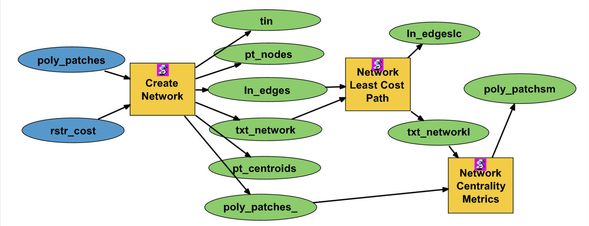
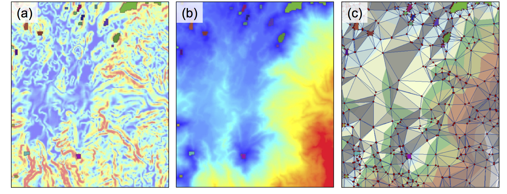
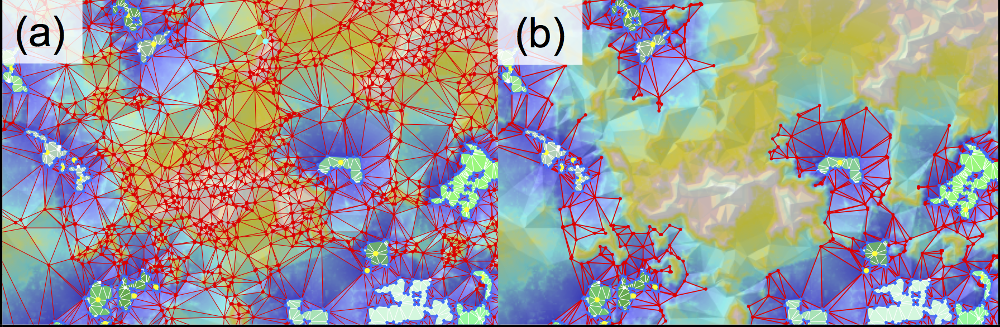

# connmod

Connectivity Modeling

- originally transferred from subversion revision 123 (bbest, 2011-02-28) at <https://code.env.duke.edu/svn/connmod/trunk/> (note other branches there; login required at <https://code.env.duke.edu/projects/connmod/browser>)

## Abstract

Quantifying connectivity between patches of habitat is important to the prediction of population viability, genetic fitness and spread of contagion (Urban and Keitt 2001).  Graph theory provides a robust set of algorithms with which to analyze connectivity over a network.  The majority of conservation-based networks to date have been based on simplistic networks to describe habitat patches as nodes and corridors as connected straight edges. 

The Connectivity Modeling (ConMod) toolbox further discriminates between three node types (centroid, perimeter and matrix) as well as two edge types (interior and exterior).  Only two inputs are required: polygons uniquely identifying habitat patches, and a raster of cost representing resistance in dispersing over a given cell.  The network is created by extraction from a Triangulated Irregular Network (TIN) representation of the cost surface accumulating away from patches.  The resulting network has several major advantages over simpler approaches:  the corridors are non-linear and shaped by the matrix (i.e. the cost-surface outside the patches) and the functional distance (i.e. cumulative cost along a corridor) while preserving spatial topology (i.e. geographical coordinates).  This novel use of TINs and graph-theoretic algorithms has huge computational efficiencies for simultaneously calculating least-cost paths between all patches over typical raster-based methods.  Additional graph-theoretic metrics are available per patch such as degree and betweenness.  The graph-theoretic functions are provided by the Python programming package NetworkX.

All outputs can be easily visualized, layered and manipulated within the ArcGIS environment.  Python, being the scripting language of the ESRI geoprocessing engine,  also controls the R application (through R DCOM and Python win32com libraries) as well as the NetworkX package.  All code is open-source and customizable, providing a flexible and robust tool for conservation biology.

_ConnMod tools (yellow boxes) in an example ESRI Model Builder workflow with inputs (blue) and outputs (green) as ellipses._

_Create Network tool example showing the original cost surface (a), the internally generated cumulative cost surface away from patches (b), and the resulting TIN and extracted network (c)._

_Example output of Truncate Network tool which renders a trimmed network (b) based on limiting the functional dispersal distance from a fuller network (a).  Nodes with 1 or 0 connections, ie non-cyclic danglers, are also removed._
